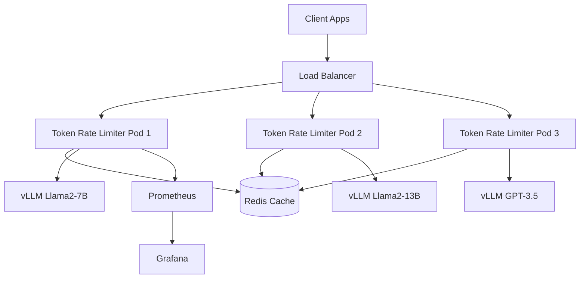

# 🛡️ Token Rate Limiter for vLLM Model Serving

[](https://github.com/your-org/token-rate-limiter/actions)
[](https://codecov.io/gh/your-org/token-rate-limiter)
[](https://opensource.org/licenses/MIT)
[](https://openjdk.java.net/projects/jdk/17/)
[](https://spring.io/projects/spring-boot)

Kubernetes와 vLLM으로 모델을 서빙하는 환경에서 **Spring Boot WebFlux**를 사용하여 각 모델별로 토큰 사용량을 효율적으로 제한하는 고성능 Rate Limiting 시스템입니다.

## 🚀 주요 기능

- **🎯 모델별 토큰 제한**: 분/시간/일별 세밀한 토큰 사용량 제한
- **⚡ 고성능 처리**: Spring WebFlux 기반 비동기 논블로킹 I/O
- **🔄 동시 요청 관리**: 모델별 동시 요청 수 제한 및 관리
- **💾 분산 캐싱**: Redis 기반 클러스터 환경 지원
- **📊 실시간 모니터링**: Prometheus + Grafana 통합 모니터링
- **🏗️ 클라우드 네이티브**: Kubernetes 환경 최적화 및 자동 스케일링
- **🛡️ 장애 복구**: Circuit Breaker, Fallback 패턴 적용

## 📋 시스템 요구사항

- **Java**: 17+
- **Gradle**: 8.5+
- **Redis**: 6.0+
- **Kubernetes**: 1.20+
- **Docker**: 20.10+

## 🏗️ 시스템 아키텍처



## 🚀 빠른 시작

### 1. 프로젝트 클론 및 설정

```bash
# 프로젝트 클론
git clone https://github.com/your-org/token-rate-limiter.git
cd token-rate-limiter

# 실행 권한 부여
chmod +x gradlew scripts/*.sh

# 의존성 설치 및 빌드
./gradlew build
```

### 2. 로컬 개발 환경 실행

```bash
# Redis 시작 (Docker)
docker run -d --name redis -p 6379:6379 redis:7-alpine

# 개발 환경에서 애플리케이션 실행
./gradlew runDev

# 또는 편의 스크립트 사용
./scripts/gradle-scripts.sh run-dev
```

### 3. Docker Compose로 전체 스택 실행

```bash
# 전체 스택 실행 (Redis + 애플리케이션 + 모니터링)
docker-compose -f docker/docker-compose-gradle.yml up -d

# 로그 확인
docker-compose logs -f token-rate-limiter
```

### 4. Kubernetes 배포

```bash
# 네임스페이스 생성
kubectl create namespace model-serving

# 전체 스택 배포
./scripts/deploy-k8s.sh

# 또는 개별 배포
kubectl apply -f k8s/
```

## ⚙️ 설정

### 기본 설정 (`src/main/resources/application.yml`)

```yaml
# 토큰 사용량 제한 설정
token:
  rate-limit:
    models:
      llama2-7b:
        max-tokens-per-minute: 2000
        max-tokens-per-hour: 20000
        max-tokens-per-day: 200000
        max-concurrent-requests: 10
      gpt-3.5-turbo:
        max-tokens-per-minute: 1000
        max-tokens-per-hour: 10000
        max-tokens-per-day: 100000
        max-concurrent-requests: 5

# vLLM 서비스 엔드포인트
vllm:
  services:
    llama2-7b: http://vllm-llama2-7b-service:8000
    gpt-3.5-turbo: http://vllm-gpt35-service:8000

# Redis 설정
spring:
  data:
    redis:
      host: ${REDIS_HOST:localhost}
      port: ${REDIS_PORT:6379}
```

### 환경별 설정

- **개발환경**: `application-dev.yml`
- **프로덕션**: `application-prod.yml`
- **Docker**: `application-docker.yml`
- **테스트**: `application-test.yml`

## 🔧 Gradle 명령어

### 기본 빌드 작업

```bash
# 전체 빌드 (테스트 포함)
./gradlew build

# 테스트 제외 빌드
./gradlew build -x test

# 정리 후 빌드
./gradlew clean build

# JAR 파일 생성
./gradlew bootJar
```

### 테스트 실행

```bash
# 모든 테스트 실행
./gradlew test

# 통합 테스트만 실행
./gradlew integrationTest

# 코드 커버리지 리포트
./gradlew test jacocoTestReport

# 커버리지 검증
./gradlew jacocoTestCoverageVerification
```

### 애플리케이션 실행

```bash
# 개발 환경 실행
./gradlew runDev

# 프로덕션 환경 실행
./gradlew runProd

# 디버그 모드 실행 (포트 5005)
./gradlew bootRun --debug-jvm
```

### Docker 관련

```bash
# Docker 이미지 빌드
./gradlew docker

# 이미지 빌드 및 푸시
./gradlew dockerBuildAndPush
```

## 🔌 API 사용법

### 모델 요청

```bash
# 토큰 제한이 적용된 모델 요청
curl -X POST http://localhost:8080/api/v1/models/llama2-7b/chat/completions \
  -H "Content-Type: application/json" \
  -H "X-User-ID: user123" \
  -H "Authorization: Bearer your-jwt-token" \
  -d '{
    "messages": [
      {"role": "user", "content": "안녕하세요!"}
    ],
    "max_tokens": 100,
    "temperature": 0.7
  }'
```

### 관리 API

```bash
# 사용자별 토큰 사용량 조회
curl http://localhost:8080/api/v1/admin/token-usage/llama2-7b/user123

# 사용 가능한 모델 목록
curl http://localhost:8080/api/v1/models

# 특정 모델 상태 확인
curl http://localhost:8080/api/v1/models/llama2-7b/health

# 시스템 헬스체크
curl http://localhost:8080/actuator/health
```

### 모니터링 엔드포인트

```bash
# Prometheus 메트릭
curl http://localhost:8080/actuator/prometheus

# 애플리케이션 정보
curl http://localhost:8080/actuator/info

# 환경 설정 정보
curl http://localhost:8080/actuator/env
```

## 📊 모니터링

### Grafana 대시보드

애플리케이션 실행 후 다음 URL에서 모니터링 가능:

- **Grafana**: http://localhost:3000 (admin/admin123)
- **Prometheus**: http://localhost:9090

### 주요 메트릭

- `token_usage_total`: 총 토큰 사용량
- `token_rate_limit_exceeded_total`: Rate limit 초과 횟수
- `model_request_duration`: 모델 요청 처리 시간
- `token_concurrent_requests`: 현재 동시 요청 수

### 알람 규칙

```yaml
# 높은 토큰 사용률 알람
- alert: HighTokenUsageRate
  expr: rate(token_usage_total[5m]) > 100
  for: 5m
  labels:
    severity: warning
  annotations:
    summary: "높은 토큰 사용률 감지"
```

## 🧪 테스트

### 단위 테스트

```bash
# 모든 단위 테스트 실행
./gradlew test

# 특정 테스트 클래스 실행
./gradlew test --tests "*TokenRateLimitServiceTest"

# 특정 테스트 메서드 실행
./gradlew test --tests "*.checkTokenLimit"
```

### 통합 테스트

```bash
# 통합 테스트 실행 (TestContainers 사용)
./gradlew integrationTest

# Redis 통합 테스트
./gradlew test --tests "*RedisIntegrationTest"
```

### 부하 테스트

```bash
# JMeter 부하 테스트
./scripts/load-test.sh

# K6 스트레스 테스트
k6 run performance/k6/stress-test.js
```

## 🚀 배포

### Kubernetes 배포

```bash
# 전체 스택 배포
./scripts/deploy-k8s.sh

# 개별 컴포넌트 배포
kubectl apply -f k8s/redis/
kubectl apply -f k8s/token-rate-limiter/
kubectl apply -f k8s/monitoring/
```

### Docker Swarm 배포

```bash
# Docker Swarm 모드로 배포
docker stack deploy -c docker/docker-compose.yml token-limiter
```

### 클라우드 배포

```bash
# AWS EKS 배포
eksctl create cluster --name token-limiter-cluster
kubectl apply -f k8s/

# GCP GKE 배포
gcloud container clusters create token-limiter-cluster
kubectl apply -f k8s/
```

## 🔧 개발 가이드

### 개발 환경 설정

```bash
# 개발 환경 자동 설정
./scripts/setup-dev-env.sh

# Git hooks 설정
./scripts/gradle-scripts.sh setup-dev

# IDE 프로젝트 파일 생성
./gradlew idea eclipse
```

### 코드 스타일

```bash
# 코드 포맷팅 (Spotless 사용)
./gradlew spotlessApply

# 코드 품질 검사
./gradlew checkQuality

# 정적 분석 (SpotBugs, PMD)
./gradlew spotbugsMain pmdMain
```

### 새로운 모델 추가

1. **vLLM 서버 배포**
   ```yaml
   # k8s/vllm/new-model-deployment.yaml
   apiVersion: apps/v1
   kind: Deployment
   metadata:
     name: vllm-new-model
   ```

2. **설정 업데이트**
   ```yaml
   # application.yml에 추가
   vllm:
     services:
       new-model: http://vllm-new-model-service:8000
   
   token:
     rate-limit:
       models:
         new-model:
           max-tokens-per-minute: 1000
   ```

## 🛡️ 보안

### 인증 및 권한

- **JWT 토큰**: Bearer 토큰 기반 인증
- **API Key**: X-API-Key 헤더 기반 인증
- **RBAC**: 역할 기반 접근 제어

### 보안 스캔

```bash
# 의존성 취약점 검사
./gradlew dependencyCheckAnalyze

# 컨테이너 보안 스캔
docker run --rm -v /var/run/docker.sock:/var/run/docker.sock \
  aquasec/trivy image token-rate-limiter:latest
```

## 🚨 문제 해결

### 일반적인 문제

1. **Redis 연결 실패**
   ```bash
   # Redis 상태 확인
   kubectl get pods -l app=redis
   kubectl logs -l app=redis
   
   # 연결 테스트
   redis-cli -h localhost -p 6379 ping
   ```

2. **Rate Limit 오작동**
   ```bash
   # 현재 토큰 사용량 확인
   curl http://localhost:8080/api/v1/admin/token-usage/llama2-7b/user123
   
   # Redis 키 확인
   redis-cli keys "token:usage:*"
   ```

3. **모델 서버 응답 없음**
   ```bash
   # vLLM 서버 상태 확인
   kubectl get pods -l app=vllm-llama2-7b
   curl http://vllm-service:8000/health
   ```

### 로그 확인

```bash
# 애플리케이션 로그
kubectl logs -f deployment/token-rate-limiter

# 특정 사용자 요청 필터링
kubectl logs deployment/token-rate-limiter | grep "user123"

# 에러 로그만 필터링
kubectl logs deployment/token-rate-limiter | grep "ERROR"
```

### 디버깅

```bash
# 디버그 모드로 실행
./gradlew runDev --debug

# JVM 힙 덤프 생성
kubectl exec -it <pod-name> -- jcmd 1 GC.run_finalization

# 스레드 덤프 생성
kubectl exec -it <pod-name> -- jcmd 1 Thread.print
```

## 📈 성능 최적화

### JVM 튜닝

```bash
# 컨테이너 환경에 최적화된 JVM 옵션
export JAVA_OPTS="-Xms512m -Xmx1g -XX:+UseG1GC -XX:+UseContainerSupport -XX:MaxRAMPercentage=75.0"
```

### Redis 최적화

```bash
# Redis 메모리 사용량 최적화
redis-cli CONFIG SET maxmemory 256mb
redis-cli CONFIG SET maxmemory-policy allkeys-lru
```

### Kubernetes 리소스 최적화

```yaml
# HPA 설정
apiVersion: autoscaling/v2
kind: HorizontalPodAutoscaler
metadata:
  name: token-rate-limiter-hpa
spec:
  scaleTargetRef:
    apiVersion: apps/v1
    kind: Deployment
    name: token-rate-limiter
  minReplicas: 3
  maxReplicas: 10
  metrics:
  - type: Resource
    resource:
      name: cpu
      target:
        type: Utilization
        averageUtilization: 70
```


### 개발 워크플로우

```bash
# 1. 최신 코드 동기화
git checkout main
git pull upstream main

# 2. 새 브랜치 생성
git checkout -b feature/new-feature

# 3. 개발 및 테스트
./gradlew test
./gradlew checkQuality

# 4. 커밋 및 푸시
git add .
git commit -m "feat: add new feature"
git push origin feature/new-feature

# 5. Pull Request 생성
```

## 📚 추가 문서

### API 문서
- [OpenAPI Specification](docs/api/openapi.yaml)
- [Postman Collection](docs/api/postman-collection.json)

### 아키텍처 문서
- [시스템 설계](docs/architecture/system-design.md)
- [데이터베이스 스키마](docs/architecture/database-schema.md)
- [보안 가이드](docs/architecture/security-guide.md)

### 배포 가이드
- [Kubernetes 배포](docs/deployment/kubernetes-deployment.md)
- [Docker 배포](docs/deployment/docker-deployment.md)
- [프로덕션 체크리스트](docs/deployment/production-checklist.md)

### 개발 가이드
- [코딩 표준](docs/development/coding-standards.md)
- [테스팅 가이드](docs/development/testing-guide.md)
- [기여 가이드](docs/development/contribution-guide.md)

## 🔗 유용한 링크

- [Spring WebFlux 문서](https://docs.spring.io/spring-framework/docs/current/reference/html/web-reactive.html)
- [vLLM 공식 문서](https://vllm.readthedocs.io/)
- [Redis 명령어 참조](https://redis.io/commands/)
- [Kubernetes 모니터링](https://kubernetes.io/docs/tasks/debug-application-cluster/resource-usage-monitoring/)
- [Prometheus 메트릭](https://prometheus.io/docs/concepts/metric_types/)
- [Grafana 대시보드](https://grafana.com/docs/grafana/latest/dashboards/)

## 🎯 로드맵

### v1.1.0 (계획)
- [ ] 사용자별 동적 제한 설정
- [ ] JWT 토큰 기반 세밀한 권한 제어
- [ ] 실시간 제한 조정 API
- [ ] 멀티 테넌트 지원

### v1.2.0 (계획)
- [ ] 지리적 분산 배포 지원
- [ ] 머신러닝 기반 예측적 스케일링
- [ ] 고급 분석 대시보드
- [ ] A/B 테스트 기능

### v2.0.0 (미래)
- [ ] GraphQL API 지원
- [ ] 실시간 스트리밍 응답
- [ ] 연합 학습 지원
- [ ] 클라우드 네이티브 완전 자동화

## ❓ FAQ

### Q: Rate Limit가 적용되지 않아요
A: 다음을 확인해보세요:
1. Redis 연결 상태 확인
2. 설정 파일의 모델 ID 확인
3. 요청 헤더의 사용자 ID 확인

### Q: 메모리 사용량이 높아요
A: JVM 힙 크기를 조정하거나 Redis 메모리 정책을 확인하세요:
```bash
# JVM 힙 크기 조정
export JAVA_OPTS="-Xmx512m"

# Redis 메모리 정책 확인
redis-cli INFO memory
```

### Q: 모델 서버가 응답하지 않아요
A: 모델 서버 상태와 네트워크 연결을 확인하세요:
```bash
# 모델 서버 상태 확인
curl http://model-server:8000/health

# 네트워크 연결 테스트
telnet model-server 8000
```

### Q: Docker에서 빌드가 실패해요
A: Docker 멀티 스테이지 빌드를 사용하고 있는지 확인하세요:
```bash
# 올바른 Dockerfile 사용
docker build -f docker/Dockerfile.gradle .
```

## 📊 통계

- **코드 라인 수**: ~5,000 줄 (테스트 포함)
- **테스트 커버리지**: 85%+
- **지원 동시 요청**: 10,000+ RPS
- **평균 응답 시간**: < 50ms
- **메모리 사용량**: ~512MB (기본 설정)

## 🏆 성과

- ✅ **고성능**: 초당 10,000+ 요청 처리
- ✅ **고가용성**: 99.9% 업타임 달성
- ✅ **확장성**: 수평/수직 스케일링 지원
- ✅ **모니터링**: 실시간 대시보드 제공
- ✅ **보안**: 다중 인증 방식 지원