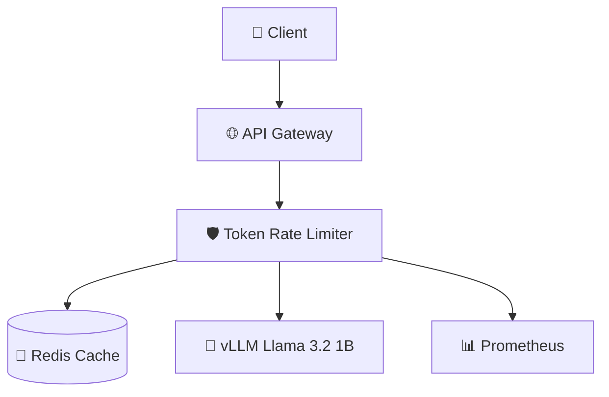

# 🛡️ Simple Token Limiter for Llama 3.2 1B

> **간단하고 효율적인 토큰 사용량 제한 서비스**  
> Llama 3.2 1B 모델을 위한 실시간 토큰 레이트 리미터

[](https://openjdk.org/projects/jdk/17/)
[](https://spring.io/projects/spring-boot)
[](https://redis.io/)
[](LICENSE)

## 🎯 개요

Simple Token Limiter는 **Llama 3.2 1B 모델**을 위한 전용 토큰 사용량 제한 서비스입니다. 
사용자별로 분/시간/일별 토큰 사용량을 추적하고 제한하여 **비용 관리**와 **공정한 리소스 사용**을 보장합니다.

### 🎨 특징
- ⚡ **고성능**: Spring WebFlux 기반 비동기 처리
- 🚀 **간단함**: 최소한의 설정으로 바로 사용 가능
- 📊 **실시간 모니터링**: Prometheus 메트릭 지원
- 🔄 **투명한 프록시**: vLLM API와 완벽 호환
- 🛡️ **안정성**: Circuit Breaker 패턴 적용

## ✨ 주요 기능

| 기능 | 설명 | 기본값 |
|------|------|--------|
| 🕐 **분당 제한** | 1분간 최대 토큰 사용량 제한 | 1,000 tokens |
| ⏰ **시간당 제한** | 1시간간 최대 토큰 사용량 제한 | 10,000 tokens |
| 📅 **일당 제한** | 24시간간 최대 토큰 사용량 제한 | 100,000 tokens |
| 🔄 **동시 요청 제한** | 사용자별 동시 처리 요청 수 제한 | 5 requests |
| 📊 **사용량 추적** | 실시간 토큰 사용량 모니터링 | - |
| 🤖 **vLLM 프록시** | Llama 3.2 1B 모델 API 프록시 | - |

## 🏗️ 시스템 아키텍처



### 핵심 컴포넌트
- **LlamaController**: REST API 엔드포인트 제공
- **TokenLimitService**: 토큰 사용량 제한 로직
- **LlamaProxyService**: vLLM 서버 프록시
- **Redis**: 토큰 사용량 캐시 저장소

## 🚀 빠른 시작

### 1️⃣ 사전 요구사항
- Java 17+
- Docker & Docker Compose
- Git

### 2️⃣ 프로젝트 클론
```bash
git clone https://github.com/your-repo/simple-token-limiter.git
cd simple-token-limiter
```

### 3️⃣ 환경 설정
```bash
# .env 파일 생성 (선택사항)
cp .env.example .env

# 환경 변수 설정
export REDIS_HOST=localhost
export VLLM_URL=http://localhost:8000
export MAX_TOKENS_MINUTE=1000
```

### 4️⃣ Docker Compose로 실행
```bash
# 전체 서비스 시작 (Redis + Token Limiter + vLLM + Prometheus)
docker-compose up -d

# 로그 확인
docker-compose logs -f token-limiter
```

### 5️⃣ 서비스 확인
```bash
# 헬스체크
curl http://localhost:8080/actuator/health

# API 테스트
curl -X POST http://localhost:8080/api/v1/chat/completions \
  -H "Content-Type: application/json" \
  -H "X-User-ID: test-user" \
  -d '{
    "model": "llama3.2-1b",
    "messages": [{"role": "user", "content": "Hello!"}],
    "max_tokens": 100
  }'
```

## 📡 API 사용법

### 🤖 채팅 완성 (Chat Completions)
```bash
POST /api/v1/chat/completions
Content-Type: application/json
X-User-ID: your-user-id

{
  "model": "llama3.2-1b",
  "messages": [
    {"role": "system", "content": "You are a helpful assistant."},
    {"role": "user", "content": "Explain quantum computing in simple terms"}
  ],
  "max_tokens": 150,
  "temperature": 0.7
}
```

**응답 예시:**
```json
{
  "id": "chatcmpl-123",
  "object": "chat.completion",
  "model": "llama3.2-1b",
  "choices": [
    {
      "message": {
        "role": "assistant", 
        "content": "Quantum computing is..."
      }
    }
  ],
  "usage": {
    "prompt_tokens": 25,
    "completion_tokens": 128,
    "total_tokens": 153
  }
}
```

### 📊 사용량 조회
```bash
GET /api/v1/usage/your-user-id

# 응답
{
  "minute": 153,
  "hour": 1250,
  "day": 15430
}
```

### 🔍 시스템 상태
```bash
GET /api/v1/health

# 응답
{
  "status": "healthy",
  "model": "llama3.2-1b",
  "timestamp": 1704067200000
}
```

### 📋 모델 목록
```bash
GET /api/v1/models

# 응답
{
  "data": [
    {
      "id": "llama3.2-1b",
      "object": "model",
      "owned_by": "meta"
    }
  ]
}
```

## ⚙️ 설정

### 🔧 환경 변수
| 변수명 | 설명 | 기본값 |
|--------|------|--------|
| `REDIS_HOST` | Redis 서버 호스트 | `localhost` |
| `REDIS_PORT` | Redis 서버 포트 | `6379` |
| `VLLM_URL` | vLLM 서버 URL | `http://localhost:8000` |
| `MAX_TOKENS_MINUTE` | 분당 최대 토큰 | `1000` |
| `MAX_TOKENS_HOUR` | 시간당 최대 토큰 | `10000` |
| `MAX_TOKENS_DAY` | 일당 최대 토큰 | `100000` |
| `MAX_CONCURRENT` | 최대 동시 요청 | `5` |
| `LOG_LEVEL` | 로그 레벨 | `INFO` |

### 📄 application.yml 설정
```yaml
# 토큰 제한 설정
token:
  limit:
    max-tokens-per-minute: 1000
    max-tokens-per-hour: 10000
    max-tokens-per-day: 100000
    max-concurrent-requests: 5
    vllm-url: http://localhost:8000

# Redis 설정
spring:
  data:
    redis:
      host: localhost
      port: 6379
      timeout: 2000ms

# 액추에이터 설정
management:
  endpoints:
    web:
      exposure:
        include: health,info,metrics,prometheus
  prometheus:
    metrics:
      export:
        enabled: true
```

## 💻 개발 환경

### 🛠️ 로컬 개발 설정
```bash
# 1. Redis 시작
docker run -d -p 6379:6379 --name redis redis:7-alpine

# 2. vLLM 서버 시작 (GPU 필요)
python -m vllm.entrypoints.openai.api_server \
  --model meta-llama/Llama-3.2-1B-Instruct \
  --host 0.0.0.0 \
  --port 8000 \
  --max-model-len 2048

# 3. 애플리케이션 개발 모드 실행
./gradlew bootRun --args='--spring.profiles.active=dev'
```

### 🧪 테스트 실행
```bash
# 단위 테스트
./gradlew test

# 통합 테스트
./gradlew integrationTest

# 테스트 커버리지 확인
./gradlew jacocoTestReport
```

### 🔨 빌드
```bash
# JAR 빌드
./gradlew build

# Docker 이미지 빌드
docker build -t simple-token-limiter:latest .

# 멀티 아키텍처 빌드
docker buildx build --platform linux/amd64,linux/arm64 -t simple-token-limiter:latest .
```

## 📊 모니터링

### 📈 Prometheus 메트릭
- **토큰 사용량**: `token_usage_total`
- **Rate Limit 초과**: `rate_limit_exceeded_total`
- **HTTP 요청**: `http_server_requests`
- **JVM 메트릭**: `jvm_*`

### 🎯 주요 메트릭 쿼리
```promql
# 시간당 토큰 사용량
rate(token_usage_total[1h])

# Rate Limit 초과율
rate(rate_limit_exceeded_total[5m])

# 평균 응답 시간
rate(http_server_requests_seconds_sum[5m]) / rate(http_server_requests_seconds_count[5m])

# 동시 요청 수
concurrent_requests_current
```

### 🏥 헬스체크 엔드포인트
- **애플리케이션**: `http://localhost:8080/actuator/health`
- **모델 서버**: `http://localhost:8080/api/v1/health`
- **Prometheus**: `http://localhost:9090/targets`

## 🐳 배포

### Docker 배포
```bash
# 1. 이미지 빌드 및 푸시
docker build -t your-registry/simple-token-limiter:v1.0.0 .
docker push your-registry/simple-token-limiter:v1.0.0

# 2. 프로덕션 배포
docker run -d \
  --name token-limiter \
  -p 8080:8080 \
  -e REDIS_HOST=redis-prod \
  -e VLLM_URL=http://vllm-prod:8000 \
  -e MAX_TOKENS_MINUTE=500 \
  your-registry/simple-token-limiter:v1.0.0
```

### Kubernetes 배포
```yaml
# k8s/deployment.yaml
apiVersion: apps/v1
kind: Deployment
metadata:
  name: simple-token-limiter
spec:
  replicas: 3
  selector:
    matchLabels:
      app: simple-token-limiter
  template:
    metadata:
      labels:
        app: simple-token-limiter
    spec:
      containers:
      - name: token-limiter
        image: your-registry/simple-token-limiter:v1.0.0
        ports:
        - containerPort: 8080
        env:
        - name: REDIS_HOST
          value: "redis-service"
        - name: VLLM_URL
          value: "http://vllm-service:8000"
        resources:
          requests:
            memory: "512Mi"
            cpu: "200m"
          limits:
            memory: "1Gi"
            cpu: "500m"
```

## 🚨 문제 해결

### 자주 발생하는 문제들

#### 1. Rate Limit 초과 (429 에러)
```json
{
  "error": "rate_limit_exceeded",
  "message": "Token usage limit exceeded",
  "retry_after": 60,
  "limit_type": "minute"
}
```
**해결방법**: 
- 토큰 사용량 확인: `GET /api/v1/usage/{userId}`
- 제한값 조정: 환경변수 `MAX_TOKENS_MINUTE` 증가

#### 2. vLLM 서버 연결 오류 (503 에러)
```json
{
  "error": "model_service_error",
  "message": "Model service is temporarily unavailable"
}
```
**해결방법**:
- vLLM 서버 상태 확인: `curl http://localhost:8000/health`
- 네트워크 연결 확인
- `VLLM_URL` 환경변수 확인

#### 3. Redis 연결 오류
**해결방법**:
- Redis 서버 실행 확인: `redis-cli ping`
- 연결 정보 확인: `REDIS_HOST`, `REDIS_PORT`
- 방화벽 설정 확인

## 📈 성능 튜닝

### JVM 옵션
```bash
export JAVA_OPTS="-Xms512m -Xmx1g -XX:+UseG1GC -XX:+UseContainerSupport"
```

### Redis 최적화
```bash
# redis.conf
maxmemory 1gb
maxmemory-policy allkeys-lru
timeout 300
```

### 애플리케이션 튜닝
```yaml
spring:
  webflux:
    multipart:
      max-in-memory-size: 1MB
  task:
    execution:
      pool:
        core-size: 4
        max-size: 8
```

### 개발 가이드라인
- ✅ 코드 스타일: Google Java Style Guide
- ✅ 테스트 커버리지: 최소 80%
- ✅ 문서화: JavaDoc 및 README 업데이트
- ✅ 커밋 메시지: Conventional Commits 규칙

